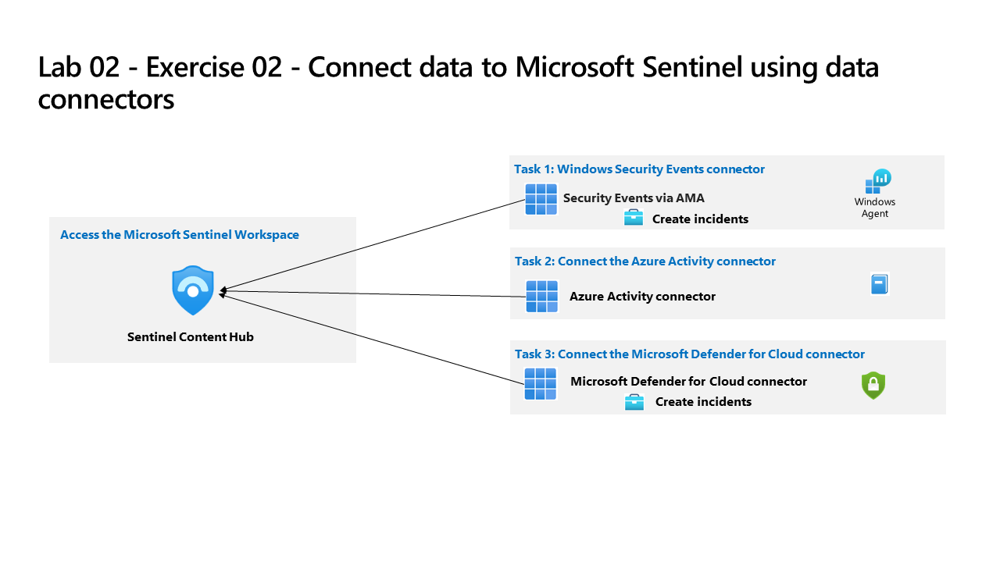

---
lab:
  title: 'Exercício 02: ingerir dados de eventos de segurança do Windows'
  module: Guided Project - Deploy Microsoft Sentinel Content Hub solutions and data connectors
---

>**Observação**: este laboratório baseia-se no Laboratório 01. Para concluir este laboratório, você precisará de uma [assinatura do Azure](https://azure.microsoft.com/free/?azure-portal=true). no qual você tem acesso administrativo.

## Diretrizes gerais

- Ao criar objetos, use as configurações padrão, a não ser que haja requisitos que exijam configurações diferentes.
- Somente crie, exclua ou modifique objetos para atingir os requisitos declarados. Alterações desnecessárias no ambiente podem afetar negativamente sua pontuação final.
- Se houver várias abordagens para alcançar uma meta, escolha sempre a abordagem que requer o mínimo de esforço administrativo.

Precisamos configurar o Microsoft Sentinel para ingerir dados usando as soluções do Microsoft Sentinel.

## Diagrama de arquitetura

## Tarefas de habilidades

Você precisa implantar soluções do Hub de Conteúdo no workspace do Microsoft Sentinel e atender aos seguintes requisitos:

- Instale o seguinte soluções:
  - Eventos de segurança do Windows.
  - Conector de atividades do Azure.
  - Microsoft Defender para Nuvem.
- Configure o conector de dados para as Atividades do Azure para aplicar todos os recursos, novos e já existentes, à assinatura.
- Configure o conector de dados do Microsoft Defender para Nuvem para se conectar à assinatura do Azure e garantir que apenas a sincronização bidirecional esteja habilitada.
- Habilite uma regra de análise com base no modelo do número suspeito de atividades de criação ou implantação de recursos. A regra deve ser executada a cada hora e procurar apenas nos dados dessa última hora.
- Verifique se a pasta de trabalho das Atividades do Azure está disponível em Minhas pastas de trabalho.

## Instruções para o exercício

>**Observação**: nas tarefas a seguir, para acessar `Microsoft Sentinel`, selecione o `workspace` que você criou no Laboratório 01.

### Tarefa 1 – Implantar uma solução de hub de conteúdo no Microsoft Sentinel

Implante uma solução de hub de conteúdo e configure os conectores de dados. Saiba mais sobre as [soluções de hub de conteúdo](https://learn.microsoft.com/azure/sentinel/sentinel-solutions).

1. No `Microsoft Sentinel`, vá para a seção do menu `Content management` e selecione **Hub de Conteúdo**
1. Procure e selecione **Eventos de Segurança do Windows**
1. Selecione o link para **Exibir detalhes**
1. Selecione plano de eventos de segurança do Windows e selecione **Criar**
1. Selecione o grupo de recursos `RG2` que inclui o workspace do Microsoft Sentinel e selecione o `Workspace`.
1. Selecione **Avançar** na guia conectores de dados (a solução implantará 2 conectores de dados)
1. Selecione **Avançar** na guia pastas de trabalho (a solução instala pastas de trabalho)
1. Selecione **Avançar** na guia Análise (as soluções instalam regras de análise)
1. Selecione **Avançar** na guia Consultas de busca (a solução instala consultas de buscas)
1. Selecione **Examinar + criar**
1. Escolha **Criar**

1. Repita estas etapas para as `Azure Activity` e as soluções do `Microsoft Defender for Cloud`.

### Tarefa 2 – Configurar o conector de dados para as Atividades do Azure

Configure o conector de dados para as Atividades do Azure para aplicar todos os recursos, novos e já existentes, à assinatura. Saiba mais sobre o [conector de dados do Microsoft Sentinel](https://learn.microsoft.com/azure/sentinel/connect-data-sources).

  1. No `Microsoft Sentinel`, vá para a seção do menu `Content management` e selecione **Hub de Conteúdo**.
  1. Em `Content hub`, filtre `Status` por soluções instaladas.
  1. Selecione a solução `Azure Activity` e selecione **Gerenciar**.
  1. Selecione um conector de dados `Azure Activity` e depois **Abrir página do conector**.
  1. Na área `Configuration` sob a guia `Instructions`, role até `2. Connect your subscriptions...`, e selecione **Iniciar o Assistente de Atribuição do Azure Policy**.
  1. Na guia **Básico**, selecione o botão de reticências (...) em **Escopo** e selecione sua assinatura na lista suspensa e clique em **Selecionar**.
  1. Selecione a guia **Parâmetros**, escolha seu workspace na lista suspensa **Workspace principal do Log Analytics**.
  1. Selecione a guia **Correção** e marque a caixa de seleção **Criar uma tarefa de correção**.
  1. Selecione o botão **Examinar + criar** para examinar a configuração.
  1. Selecione **Criar** para concluir.
  
### Tarefa 3 – Configurar o conector de dados do Defender para Nuvem

Configure o conector de dados para o Microsoft Defender para Nuvem e não esqueça que apenas o gerenciamento de incidentes deve ser configurado.

  1. No `Microsoft Sentinel`, vá para a seção do menu `Content management` e selecione **Hub de Conteúdo**.
  1. Em `Content hub`, filtre `Status` por soluções instaladas.
  1. Selecione a solução `Microsoft Defender for Cloud` e selecione **Gerenciar**.
  1. Selecione um conector de dados do `Subscription-based Microsoft Defender for Cloud (Legacy)` e **Abrir página do conector**
  1. Na área `Configuration` abaixo da guia `Instructions`, role para baixo até sua assinatura e mova o controle deslizante na coluna `Status` para **Conectado**.
  1. Verifique se `Bi-directional sync` está **Habilitado**.

### Tarefa 4 – Criar uma regra de análise

Crie uma regra analítica com base no modelo do número suspeito de atividades de criação ou implantação de recursos. A regra deve ser executada a cada hora e procurar apenas nos dados dessa última hora. Saiba mais sobre [usar modelos de regras de análise do Microsoft Sentinel](https://learn.microsoft.com/azure/sentinel/detect-threats-built-in).

  1. No `Microsoft Sentinel`, vá para a seção do menu `Configuration` e selecione **Análise**.
  1. Na guia `Rule templates`, procure **Número suspeito de atividades de criação ou implantação de recursos**.
  1. Selecione o **Número suspeito de atividades de criação ou implantação de recursos** e selecione **Criar regra**.
  1. Deixe os padrões na guia `General` e selecione **Avançar: Definir lógica de regra >**.
  1. Deixe o padrão `Rule query` e configure `Query scheduling` usando a tabela:

     |Configuração |Valor|
     |---|---|
     |Executar consulta a cada|1 hora|
     |Dados de pesquisa a partir do último|1 hora|

  1. Selecione **Avançar: configurações de incidente >**.
  1. Deixe os padrões e selecione **Próximo: Resposta automatizada >**.
  1. Deixe os padrões e selecione **Próximo: Examinar + criar**.
  1. Selecione **Salvar**.

### Tarefa 5 – Verificar se a pasta de trabalho das Atividades do Azure está disponível em Minhas pastas de trabalho

  1. No `Microsoft Sentinel`, vá para a seção do menu `Content management` e selecione **Hub de Conteúdo**.
  1. Em `Content hub`, filtre `Status` por soluções instaladas.
  1. Selecione a solução `Azure Activity` e selecione **Gerenciar**.
  1. Marque a `checkbox` das pastas de trabalho das `Azure Activity` e, em seguida, **Configuração**.
  1. Selecione as pasta de trabalho das `Azure Activity` e selecione **Salvar**.
  1. Escolha a `Azure Region` para o seu workspace do `Microsoft Sentinel`.  
